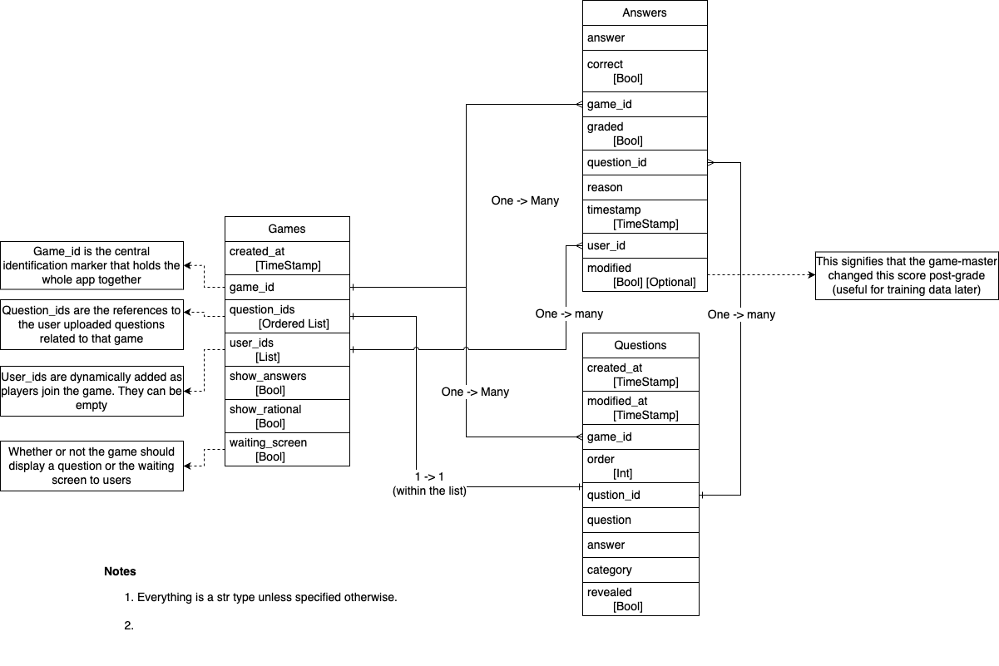

## DB Schema

## Active todos

1. Show participant scores in a table (winner gets balloons?)
2. Breakdown participant scores by round for trivia master (via the game model)
3. implement the trivia master simple view
4. add footer for my link
5. add a link provided by the trivia master for tips
6. auto-refresh the page when the trivia master updates the game
7. enable image questions
